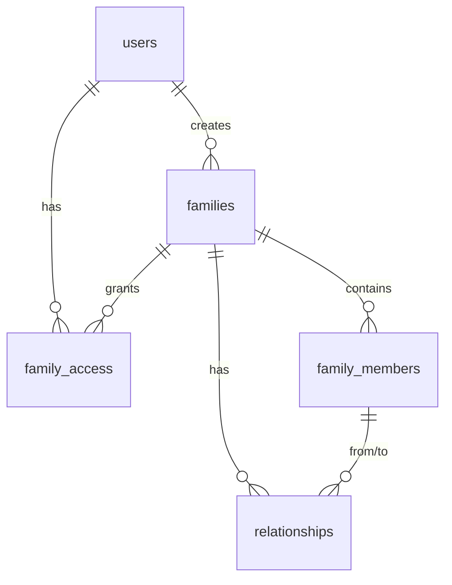

# Silsilah Keluarga PWA – Walkthrough

## Teknologi

| Layer | Teknologi |
|-------|-----------|
| Framework | Next.js 16 (App Router, Server Actions, Turbopack) |
| Styling | Tailwind CSS v4 + CSS custom properties |
| Database | Neon PostgreSQL (serverless) |
| ORM | Drizzle ORM (type-safe, ringan) |
| Auth | NextAuth.js v5 (Credentials + Google) |
| Language | TypeScript |

---

## Database Schema (5 Tabel)



| Tabel | Kolom kunci |
|-------|-------------|
| `users` | id, email, password (hash), fullName |
| `families` | id, name, description, createdBy |
| `family_members` | id, familyId, fullName, nickname, gender, birthDate, deathDate, title, phone, bio |
| `relationships` | id, familyId, fromMemberId, toMemberId, relationType (parent/child/spouse) |
| `family_access` | id, familyId, userId, role (admin/editor/viewer) |

---

## Fitur yang Sudah Dibangun

### Authentication
- Login email/password + Google OAuth
- Registrasi dengan validasi + password hashing (bcryptjs)
- Middleware proteksi rute otomatis
- JWT session strategy

### Dashboard
- Kartu bagan keluarga dengan: nama, jumlah anggota, role badge (emas admin), 🔒, ⚙️
- FAB (+) untuk buat bagan baru → bottom sheet dialog
- Empty state jika belum ada bagan

### Family Page
- **Pohon keluarga**: Custom SVG, auto-layout algorithm, zoom/pan (pointer + wheel), tombol +/−
- **Daftar anggota**: List view alternatif, klik untuk detail
- **Toggle**: Tombol 🌳 Pohon / 📋 Daftar
- **Node**: 180×90px, shadow, ♂/♀ berwarna, nickname, title, Alm./Almh. 🌼, 📱

### Member Management
- Form tambah/edit: nama lengkap, panggilan, gender, tanggal lahir/meninggal, title (saran: Buyut, Kakek, dll), HP, bio
- Detail bottom sheet: info lengkap + hubungan keluarga (klik untuk navigasi)
- Hapus anggota dengan konfirmasi

### Relationships
- Tambah hubungan: orang tua / anak / pasangan via dialog
- Bidirectional otomatis (parent ↔ child, spouse ↔ spouse)
- Tampil di detail member, bisa klik untuk navigasi

### Search
- Pencarian global di semua bagan yang diakses
- API `/api/search` – query fullName + nickname
- Hasil: kartu dengan gender, title, badge bagan asal

### Profile
- Info user (nama, email, avatar inisial)
- Pengaturan: Dark mode (ikuti sistem), Mode Mudah (segera hadir)
- Tombol logout

---

## Design System

### Warna
| | Light | Dark |
|-|-------|------|
| **Teks** | `#111827` | `#ffffff` |
| **Background** | `#f8fafc` | `#121212` |
| **Card** | `#ffffff` | `#1e1e1e` |
| **Muted** | `#6b7280` (WCAG AA ✅) | `#9ca3af` |
| **Laki-laki** | `#60a5fa` | `#93c5fd` |
| **Perempuan** | `#f472b6` | `#f9a8d4` |
| **Admin** | Emas `#b45309` | `#fbbf24` |

### Komponen CSS
Ripple effect · Glassmorphism bottom sheet · Skeleton shimmer · Context menu · Badges · FAB · Toast · Animations (fadeIn, slideUp, slideInRight)

### Checklist UI/UX
- [x] Font ≥16px · [x] Kontras WCAG AA · [x] Touch ≥48dp
- [x] Ikon + label · [x] Bottom nav · [x] Glassmorphism
- [x] Dark mode · [x] Ripple feedback · [x] Skeleton CSS
- [ ] Swipe bottom sheet · [ ] Long-press menu · [ ] Mode Mudah

---

## Build Status
```
✅ npm run build – 11 routes, 0 errors
Routes: /, /login, /register, /dashboard, /family/[id], /search, /profile, /api/*
```

## Langkah Selanjutnya
1. **Database**: Isi `DATABASE_URL` → `npx drizzle-kit push`
2. **Test**: `npm run dev` → register → buat bagan → tambah anggota
3. **Phase 4**: Access control & undangan
4. **Phase 5**: PWA, mode mudah, gesture
5. **Phase 6**: Deploy Vercel
